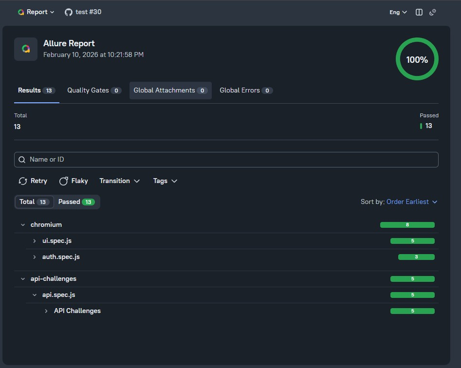
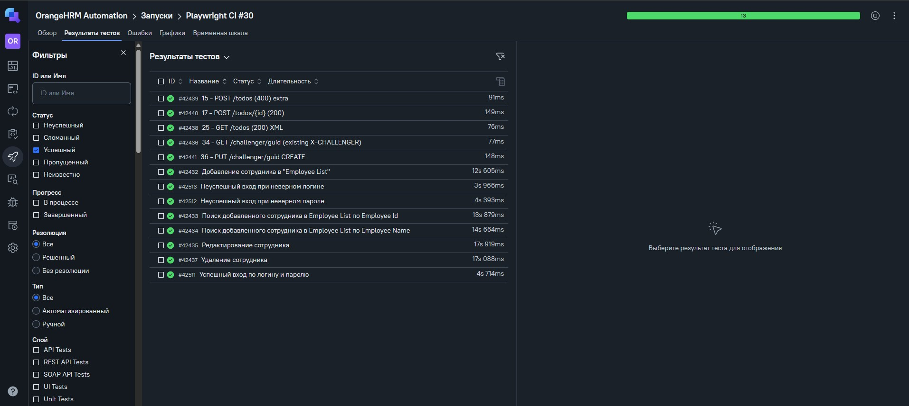
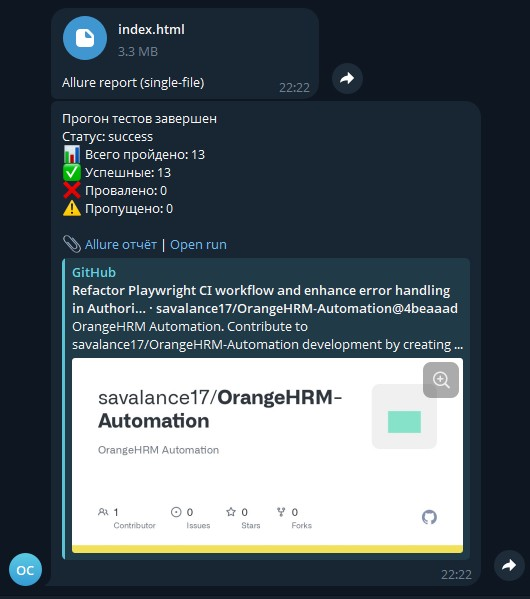

# Проект по автоматизации тестирования тестового сайта OrangeHRM

## Содержание

- [Описание](#описание)
- [Технологии](#технологии)
- [Тест-кейсы](#тест-кейсы)
- [Генерация отчётов](#генерация-отчётов)
- [Запуск в GitHub Actions](#запуск-в-github-actions)
- [Пример Allure-отчёта](#пример-allure-отчёта)
- [Пример Allure TestOps-отчёта](#пример-allure-testops-отчёта)
- [Уведомления в Telegram](#уведомления-в-telegram)
- [Подробная инструкция по запуску](#подробная-инструкция-по-запуску)

## Описание

Репозиторий содержит набор UI и API тестов, написанных на JavaScript с использованием фреймворка автоматизации Playwright. Настроен GitHub Actions как CI-система: реализован запуск автотестов, генерация Allure-отчётов, интеграция с TestOps и отправка уведомлений в Telegram.

Тестируемое приложение: [OrangeHRM](https://www.orangehrm.com/) (демо-стенд opensource-demo.orangehrmlive.com). В проекте также есть API-тесты для [API Challenges](https://apichallenges.herokuapp.com/).

## Технологии

     

**Стек:** JavaScript · Playwright · GitHub Actions · Allure Report · Allure TestOps · Telegram

## Тест-кейсы

### UI (OrangeHRM)

**Авторизация**

- ✔️ Успешный вход по логину и паролю
- ✔️ Неуспешный вход при неверном пароле
- ✔️ Неуспешный вход при неверном логине

**PIM (управление сотрудниками)**

- ✔️ Добавление сотрудника в Employee List
- ✔️ Поиск добавленного сотрудника в Employee List по Employee Id
- ✔️ Поиск добавленного сотрудника в Employee List по Employee Name
- ✔️ Редактирование сотрудника
- ✔️ Удаление сотрудника

### API (API Challenges)

- ✔️ POST /todos (400) — проверка ответа при лишнем поле
- ✔️ POST /todos/{id} (200) — создание и обновление todo
- ✔️ GET /todos (200) XML
- ✔️ GET /challenger/guid (существующий X-CHALLENGER)
- ✔️ PUT /challenger/guid CREATE

### Запуск тестов из терминала

**Все тесты:**

```bash
npm test
```

**Только UI (OrangeHRM):**

```bash
npx playwright test --project=chromium
```

**Только API:**

```bash
npx playwright test --project=api-challenges
```

**Только smoke-тесты:**

```bash
npm run test:smoke
```

## Генерация отчётов

### Allure из терминала

После прогона:

```bash
npm run allure:serve
```

Отчёт будет собран из `allure-results` и откроется в браузере.

Генерация отчёта в папку без автозапуска:

```bash
npm run allure:generate
npm run allure:open
```

## Запуск в GitHub Actions

Тесты запускаются автоматически при **push** и **pull request** в ветки `main` / `master`, а также вручную через **workflow_dispatch** (вкладка Actions → Playwright Tests → Run workflow).

После прогона Allure-отчёт публикуется на **GitHub Pages**, результаты при необходимости отправляются в Allure TestOps, в Telegram уходит файл отчёта и текстовая сводка.

## Пример Allure-отчёта

В CI отчёт собирается в single-file и публикуется на **GitHub Pages**. Локально — через `npm run allure:serve` или `npm run allure:open`.



## Пример Allure TestOps-отчёта

Результаты передаются в **Allure TestOps** через allurectl (при настроенных секретах `ALLURE_ENDPOINT`, `ALLURE_TOKEN`, `ALLURE_PROJECT_ID` в GitHub Actions).



## Уведомления в Telegram

После завершения прогона в CI бот отправляет в чат:

1. **Файл** — Allure-отчёт (single-file HTML).
2. **Сообщение** — сводка: статус прогона, количество пройденных/упавших/пропущенных тестов, ссылки на Allure-отчёт и на run в GitHub Actions.

Сводка формируется скриптом `scripts/telegram-summary.js`. В репозитории должны быть заданы секреты: `TELEGRAM_BOT_TOKEN`, `TELEGRAM_CHAT_ID`.



## Подробная инструкция по запуску

Подробная инструкция по установке зависимостей, настройке окружения и запуску тестов локально и в CI — в файле **[RUN_GUIDE.md](RUN_GUIDE.md)**.
